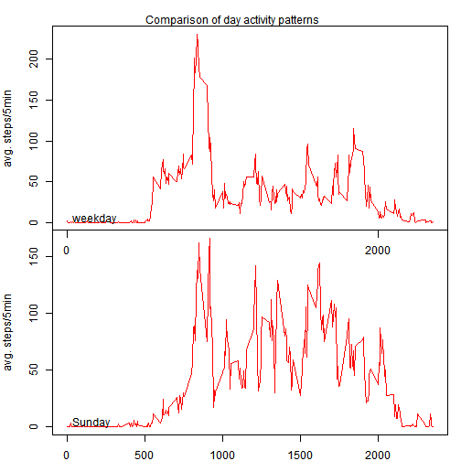

# Reproducible Research: Peer Assessment 1


## Loading and preprocessing the data
This analysis makes use of data collected from a personal activity monitoring device. 
The device collects data at 5 minute intervals throughout the day. 

The data is the number of steps walked by an anonymous individual and being recorded in 5 minute intervals each day . It covers two months of data, that was collected between the 1-st of October and 30-th of November 2012.

**Source of the data**: https://d396qusza40orc.cloudfront.net/repdata%2Fdata%2Factivity.zip

**Dataset**: contains a total of 17,568 observations.

The variables included in the dataset are:

1. *steps*: Number of steps made per 5-minute interval (there are some missing values)
2. *date*: The date on which the measurement was taken in YYYY-MM-DD format
3. *interval*: Identifier of the 5-minute interval in which measurement was recorded

The data is being downloaded, unzipped  and loaded into R dataframe using following code:

```r
library(utils)
if(!file.exists("./data/activity.csv")){
  if(!file.exists("./data")){dir.create("./data")}
  fileUrl <- "https://d396qusza40orc.cloudfront.net/repdata%2Fdata%2Factivity.zip?accessType=DOWNLOAD"
  download.file(fileUrl, destfile="./data/Factivity.zip", method="curl")
  unzip("./data/Factivity.zip",exdir="./data")
}
dt <- read.csv("./data/activity.csv", header = TRUE)
```


## What is mean total number of steps taken per day?

The answer is: 

```r
stps <- tapply(dt$steps,dt$date,sum)
format(mean(stps, na.rm=T),digits=7)
```

```
## [1] "10766.19"
```

In order to asses the correctness of the computed value, a histogram of total numbers of steps per day has been created:


```r
stps <- tapply(dt$steps,dt$date,sum)
hist(stps,col="blue",xlab="Steps per day", main="Total number of steps taken each day")
abline(v=median(stps,na.rm=T),col="red", lwd=2)
legend("topright", col="red", lwd=2, legend="mediane=mean",bty="n")
rug(stps)
```

 


Bulk of the daily totals is laying under the bar 1000 to 1500 steps/day, which supports computed value of the mean.

The concentration of the data in the area 1000-1500 can be also observed in the diagram below:


```r
par(mar=c(2, 2, 2, 2))
boxplot(stps,horizontal=T,col="blue")
```

 

The 5-number summary will give us also quantiles with the median, together with the mean:


```r
stps <- tapply(dt$steps,dt$date,sum)
summary(stps)
```

```
##    Min. 1st Qu.  Median    Mean 3rd Qu.    Max.    NA's 
##      41    8840   10800   10800   13300   21200       8
```

So **median**, is practically equal to the **mean** of total number of steps taken per day.

There are very few (but maybe interesting to look closer at) outliers.

and there are 8 days excluded from observations out of 61 because of missing values for those days.

## What is the average daily activity pattern?
The daily activity pattern of the person can be easily observed in the time series plot of steps taken averaged across all the days of the survey :


```r
par(mfrow = c(1, 1), mar = c(4, 4, 2, 1), oma = c(2, 0, 2, 0))
pattrns <- tapply(dt$steps,dt$interval,mean, na.rm=T)
plot(as.numeric(names(pattrns)),pattrns,col="red",type="l",ylab="avg. steps/5min",xlab="time (hhmm)",lab=c(5,10,7))
title("Average daily activity pattern")

maxActivityTime <- as.integer(names(which.max(pattrns)))
abline(v=maxActivityTime,col="green",lwd=2)
legend("topright", col="green", lwd=2, legend="max activity",bty="n")
```

 


```r
sprintf("%d:%d",maxActivityTime%/%100,maxActivityTime%%100)
```

```
## [1] "8:35"
```

On average, the person's activity starts about 5:30 and ends at almost midnight, with the maximum at 8:35.

## Imputing missing values

As mentioned earlier the data does not cover all of time-intervals between 12/10/01 and 12/11/30. 
Actually there are 2304 of rows missing in the dataset, which constitutes more then 10% of the sample:

```r
nulls <- is.na(dt$steps); 

paste(as.character(round(100*sum(nulls)/length(dt$steps),2)),"%")
```

```
## [1] "13.11 %"
```
To deal with missing values a simple strategy for filling in all of the missing values was implemented and a new dataset without missing values has been created:


```r
dtNew <- dt
dtNew$steps <- ifelse(nulls, as.integer(pattrns[as.character(dt$interval)]),dt$steps )
```
That replaced missing values in *steps'* field of the data at particular time-interval with the averages for this very same time-interval across all days of observations.

To see how it affected the distribution of *steps*, let's see the histogram:


```r
stpsNew <- tapply(dtNew$steps,dtNew$date,sum)
hist(stpsNew,col="red",xlab="Steps per day", main="Total number of steps taken each day")
rug(stps)
```

 

and let's compare summaries of both of the original and  "improved" datastes:


```r
summary(stps)
```

```
##    Min. 1st Qu.  Median    Mean 3rd Qu.    Max.    NA's 
##      41    8840   10800   10800   13300   21200       8
```

```r
summary(stpsNew)
```

```
##    Min. 1st Qu.  Median    Mean 3rd Qu.    Max. 
##      41    9820   10600   10700   12800   21200
```

There is not much change in between both histograms, except that the new one is *narrower* or *steeper*, i.e. there are more measurements in the middle of the range then it was, and variance seems to slightly decreased. But the range and the mean/median remained almost unchanged.


## Are there differences in activity patterns between weekdays and weekends?
There are interesting differences in the daily patterns of activity to be observed when looking at  different days of a week. The difference is particularly visible in between weekday days and Sundays:


```r
dtNew$wday <- ifelse(weekdays(as.Date(dtNew$date))!="Sunday", "weekday","weekend")
dtNew$wday <- as.factor(dtNew$wday)

pattrnsW <- tapply(dtNew[dtNew$wday=="weekday",]$steps,dtNew[dtNew$wday=="weekday",]$interval,mean)
pattrnsS <- tapply(dtNew[dtNew$wday=="weekend",]$steps,dtNew[dtNew$wday=="weekend",]$interval,mean)

par(mfrow = c(2, 1), mar = c(0, 4, 0, 1), oma = c(2, 0, 2, 0))
plot((names(pattrnsW)),pattrnsW,col="red",type="l",lab=c(1,5,7),ylab="avg. steps/5min",xlab="")
legend("bottomleft", legend="weekday",bty="n")
plot(as.numeric(names(pattrnsS)),pattrnsS,col="red",type="l",lab=c(5,5,7),ylab="avg. steps/5min",xlab="time (5 min intervals)")
legend("bottomleft", legend="Sunday",bty="n")
mtext("  Comparison of day activity patterns", outer = TRUE)
```

 

The differences in activity patterns are less prominent in between weekends (Sat-Sun) and weekday days (Mon-Fri), because of pick of activity in early hours that was preserved obviously on Saturdays.

```r
dtNew$wday[weekdays(as.Date(dtNew$date))=="Saturday"] <- "weekend"


pattrnsW <- tapply(dtNew[dtNew$wday=="weekday",]$steps,dtNew[dtNew$wday=="weekday",]$interval,mean)
pattrnsS <- tapply(dtNew[dtNew$wday=="weekend",]$steps,dtNew[dtNew$wday=="weekend",]$interval,mean)

par(mfrow = c(2, 1), mar = c(0, 4, 0, 1), oma = c(2, 0, 2, 0))
plot((names(pattrnsW)),pattrnsW,col="red",type="l",lab=c(1,5,7),ylab="avg. steps/5min",xlab="")
legend("bottomleft", legend="weekday",bty="n")
plot(as.numeric(names(pattrnsS)),pattrnsS,col="red",type="l",lab=c(5,5,7),ylab="avg. steps/5min",xlab="time (5 min intervals)")
legend("bottomleft", legend="Sunday",bty="n")
mtext("  Comparison of day activity patterns", outer = TRUE)
```

 


