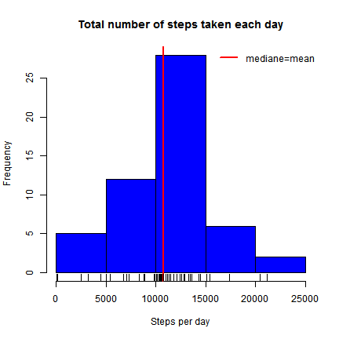
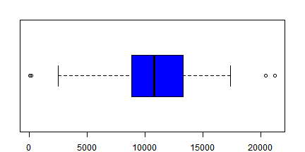
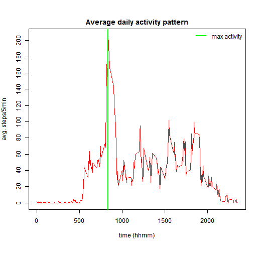
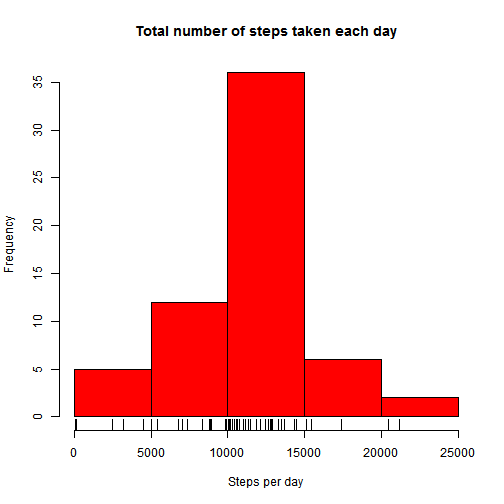
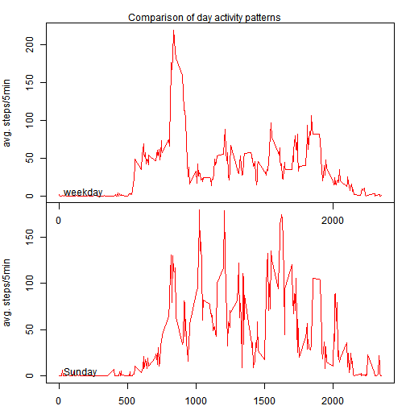

# Reproducible Research: Peer Assessment 1


## Loading and preprocessing the data
This analysis makes use of data from a personal activity monitoring device. 
The device collects data at 5 minute intervals through out the day. 

The data consists of two months of data from an anonymous individual collected between 1-st of October and 30-th of November 2012, the number of steps taken in 5 minute intervals each day.

**Source of the data**: https://d396qusza40orc.cloudfront.net/repdata%2Fdata%2Factivity.zip

**Dataset**: contains a total of 17,568 observations.

The variables included in the dataset are:

1. *steps*: Number of steps taking in a 5-minute interval (there are some missing values)
2. *date*: The date on which the measurement was taken in YYYY-MM-DD format
3. *interval*: Identifier for the 5-minute interval in which measurement was taken

The data has been loaded in R using following code:

```r
dt <- read.csv("activity.csv", header = TRUE)
stps <- tapply(dt$steps, dt$date, sum)
```


## What is mean total number of steps taken per day?
The **mean total number of steps taken per day** is = 10766.19,
to answer this question a histogram was created:


```r
stps <- tapply(dt$steps, dt$date, sum)
hist(stps, col = "blue", xlab = "Steps per day", main = "Total number of steps taken each day")
abline(v = median(stps, na.rm = T), col = "red", lwd = 2)
legend("topright", col = "red", lwd = 2, legend = "mediane=mean", bty = "n")
rug(stps)
```

 


The histogram is normal-distribution shaped and slightly right skewed.
Bulk of the daily totals is under the bar in between 1000 and 1500 steps/day.

The concentration of the data can be easier observed on the boxplot diagram below:


```r
par(mar = c(2, 2, 2, 2))
boxplot(stps, horizontal = T, col = "blue")
```

 


..or, more precisely in the 5-number summary:

```r
summary(stps)
```

```
##    Min. 1st Qu.  Median    Mean 3rd Qu.    Max.    NA's 
##      41    8840   10800   10800   13300   21200       8
```

The **median**, is practically equal to the **mean** which is = 10766.19

There are very few (but maybe interesting to look closer at) outliers and there were 8 days excluded from observations out of 61 because of missing values for these days.

## What is the average daily activity pattern?
By calculating totals of of steps taken, averaged across all days the daily activity pattern of the person can be observed:


```r
par(mfrow = c(1, 1), mar = c(4, 4, 2, 1), oma = c(2, 0, 2, 0))
pattrns <- tapply(dt$steps, dt$interval, mean, na.rm = T)
plot(as.numeric(names(pattrns)), pattrns, col = "red", type = "l", ylab = "avg. steps/5min", 
    xlab = "time (hhmm)", lab = c(5, 10, 7))
title("Average daily activity pattern")

maxActivityTime <- as.integer(names(which.max(pattrns)))
sprintf("%d:%d", maxActivityTime%/%100, maxActivityTime%%100)
```

```
## [1] "8:35"
```

```r
abline(v = maxActivityTime, col = "green", lwd = 2)
legend("topright", col = "green", lwd = 2, legend = "max activity", bty = "n")
```

 

On average, the person's activity starts about 5:30 and ceased at almost midnight, with the maximum at 8:35.

## Imputing missing values

As mentioned earlier the data does not cover all of time-intervals between 12/10/01 and 12/11/30. 
Actually there are 2304 of rows missing in the dataset:

```r
nulls <- is.na(dt$steps)
length(nulls)
```

```
## [1] 17568
```

To deal with missing values a simple strategy for filling in all of the missing values has been implemented to create the new dataset without missing values:


```r
dtNew <- dt
dtNew$steps <- ifelse(nulls, as.integer(pattrns[as.character(dt$interval)]), 
    dt$steps)
```

It replaces missing values in *steps* field at particular time-interval with  averages for this very time-interval across all days.

To see how it changed the distribution of values let's see the histogram for total number of steps taken each day:


```r
stpsNew <- tapply(dtNew$steps, dtNew$date, sum)
hist(stpsNew, col = "red", xlab = "Steps per day", main = "Total number of steps taken each day")
rug(stps)
```

 


and comparisson of 5-number summaries for both datasets:


```r
summary(stps)
```

```
##    Min. 1st Qu.  Median    Mean 3rd Qu.    Max.    NA's 
##      41    8840   10800   10800   13300   21200       8
```

```r
summary(stpsNew)
```

```
##    Min. 1st Qu.  Median    Mean 3rd Qu.    Max. 
##      41    9820   10600   10700   12800   21200
```


There is not much change in between both histograms, except that the new one is *narrower* or *steeper*, i.e. there are more measurements in the middle of the range then it was, and variance seems to have decreased. But the range and the mean/median remained almost unchanged.


## Are there differences in activity patterns between weekdays and weekends?
There are interesting differences in the daily patterns of activity to be observed when looking at  different days of a week. The difference is particulary visible in between weekday days and Sundays:


```r

dtNew$wday <- ifelse(weekdays(as.Date(dtNew$date)) != "Sunday", "weekday", "weekend")
tail(dtNew$wday)
```

```
## [1] "weekday" "weekday" "weekday" "weekday" "weekday" "weekday"
```

```r
dtNew$wday <- as.factor(dtNew$wday)

pattrnsW <- tapply(dtNew[dtNew$wday == "weekday", ]$steps, dtNew[dtNew$wday == 
    "weekday", ]$interval, mean)
pattrnsS <- tapply(dtNew[dtNew$wday == "weekend", ]$steps, dtNew[dtNew$wday == 
    "weekend", ]$interval, mean)

par(mfrow = c(2, 1), mar = c(0, 4, 0, 1), oma = c(2, 0, 2, 0))
plot((names(pattrnsW)), pattrnsW, col = "red", type = "l", lab = c(1, 5, 7), 
    ylab = "avg. steps/5min", xlab = "")
legend("bottomleft", legend = "weekday", bty = "n")
plot(as.numeric(names(pattrnsS)), pattrnsS, col = "red", type = "l", lab = c(5, 
    5, 7), ylab = "avg. steps/5min", xlab = "time (5 min intervals)")
legend("bottomleft", legend = "Sunday", bty = "n")
mtext("  Comparison of day activity patterns", outer = TRUE)
```

 


The differences in activity patterns are more prominent than in between weekend (Sat-Sun) and weekday (Mon-Fri)

```r

dtNew$wday[as.Date(dtNew$date) == "Saturday"] <- "weekend"
```

```
## Error: character string is not in a standard unambiguous format
```

```r

pattrnsW <- tapply(dtNew[dtNew$wday == "weekday", ]$steps, dtNew[dtNew$wday == 
    "weekday", ]$interval, mean)
pattrnsS <- tapply(dtNew[dtNew$wday == "weekend", ]$steps, dtNew[dtNew$wday == 
    "weekend", ]$interval, mean)

par(mfrow = c(2, 1), mar = c(0, 4, 0, 1), oma = c(2, 0, 2, 0))
plot((names(pattrnsW)), pattrnsW, col = "red", type = "l", lab = c(1, 5, 7), 
    ylab = "avg. steps/5min", xlab = "")
legend("bottomleft", legend = "weekday", bty = "n")
plot(as.numeric(names(pattrnsS)), pattrnsS, col = "red", type = "l", lab = c(5, 
    5, 7), ylab = "avg. steps/5min", xlab = "time (5 min intervals)")
legend("bottomleft", legend = "Sunday", bty = "n")
mtext("  Comparison of day activity patterns", outer = TRUE)
```

 


